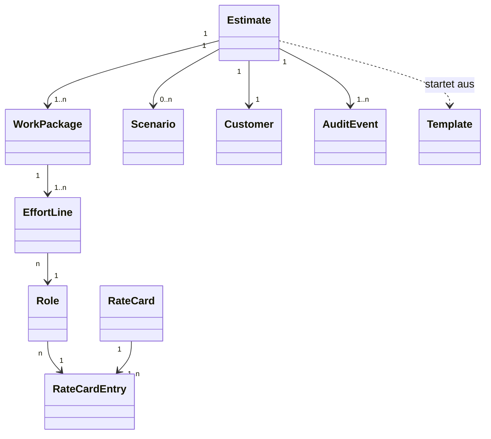

# ReqPOOL Estimation Manager — Intent-basierte Spezifikation

> **Zweck dieses Dokuments.** Diese Spezifikation ist *intent-getrieben*: Sie beschreibt
> **was** das System leisten soll und **warum** (Absicht, Ergebnis, Leitplanken), nicht
> **wie** es implementiert wird. Sie ist so strukturiert, dass autonome Coding-Agenten sie
> direkt in Implementierungsschritte überführen können — jede Anforderung hat eine stabile
> ID, jede Fähigkeit hat prüfbare Akzeptanzkriterien, jede Geschäftsregel ist als Invariante
> fixiert.
>
> **Format-Status:** v1.0 — Entwurf zur Abstimmung mit ReqPOOL.

---

## 0. Lesehinweise für Mensch und Agent

### 0.1 Normative Schlüsselwörter (RFC-2119, deutsch)
- **MUSS / DARF NICHT** — verbindlich; Verletzung = fehlerhafte Implementierung.
- **SOLL / SOLL NICHT** — dringend empfohlen; Abweichung nur mit dokumentierter Begründung.
- **KANN** — optional, im Ermessen der Umsetzung.

### 0.2 ID-Konventionen (stabil, maschinenlesbar)
| Präfix | Bedeutung | Beispiel |
|--------|-----------|----------|
| `VIS`  | Vision / Leitabsicht | `VIS-1` |
| `DOM`  | Domänenobjekt (Begriff der Fachsprache) | `DOM-Estimate` |
| `INV`  | Invariante / Geschäftsregel (immer gültig) | `INV-VAT-1` |
| `CAP`  | Capability (Fähigkeit) | `CAP-04` |
| `REQ`  | Atomare Anforderung (EARS-Syntax) | `REQ-04-2` |
| `AC`   | Akzeptanzkriterium (Gherkin) | `AC-04-2` |
| `CON`  | Schnittstellen-/Datenvertrag | `CON-EXPORT` |
| `NFR`  | Nichtfunktionale Anforderung | `NFR-SEC-1` |
| `LP`   | Technische Leitplanke (nicht präskriptiv) | `LP-3` |
| `OOS`  | Nicht im Umfang (Non-Goal) | `OOS-2` |

### 0.3 Anforderungs-Stil (EARS)
Atomare Anforderungen folgen der *Easy Approach to Requirements Syntax*:
- **Ereignis:** „WENN \<Auslöser\>, DANN MUSS das System \<Reaktion\>."
- **Zustand:** „SOLANGE \<Zustand\>, MUSS das System \<Verhalten\>."
- **Bedingung:** „FALLS \<Bedingung\>, DANN MUSS das System \<Reaktion\>."
- **Ubiquitär:** „Das System MUSS \<Eigenschaft\> jederzeit gewährleisten."

Akzeptanzkriterien sind als **Gherkin** (deutsche Schlüsselwörter `Angenommen / Wenn / Dann /
Und / Aber`) formuliert und direkt in automatisierte Tests überführbar.

---

## 1. Vision & Leitabsicht

**`VIS-1` — Nordstern.**
Der *ReqPOOL Estimation Manager* befähigt ReqPOOL-Berater:innen, für IT-/Software-
Beratungsvorhaben (Schwerpunkt öffentlicher Sektor) **verlässliche, konsistente und
prüfbare Aufwands- und Honorarschätzungen** zu erstellen und diese **fehlerfrei an den
bestehenden ReqPOOL-Angebot-Generator** zu übergeben — sodass jedes Angebot exakt den
abgestimmten Aufwand, die Rollen, Tarife und die korrekte Umsatzsteuer abbildet.

**`VIS-2` — Messbare Wirkung (Outcomes, nicht Output).**
1. Eine Schätzung lässt sich **ohne manuelle Nachrechnung** in ein Angebot überführen
   (kein Medienbruch, keine Re-Eingabe von Zahlen).
2. Honorar- und MwSt.-Werte einer Schätzung und des daraus erzeugten Angebots stimmen
   **cent-genau** überein (`INV-RECON-1`).
3. Jede Schätzung ist **rekonstruierbar**: Wer hat wann welche Annahme, welchen Tarif,
   welchen Puffer gesetzt? (Audit-Trail, `NFR-AUD-1`).
4. Schätzungen sind **wiederverwendbar**: Vergleichbare Vorhaben profitieren von
   historischen Schätzungen (Analogie-Methode, `CAP-08`).

**`VIS-3` — Designhaltung.**
Präzise, sachlich, ohne unnötigen Jargon; das System kommuniziert auf Augenhöhe mit
Fach- und Führungsebene. Schnelle, fokussierte Workflows; jede Zahl ist nachvollziehbar
hergeleitet.

---

## 2. Annahmen & offene Punkte (zur Bestätigung durch ReqPOOL)

> Diese Spezifikation wurde aus dem vorhandenen ReqPOOL-Domänenmodell (Angebot-Generator,
> Honorar-/MwSt.-Logik, Projekttypen) hergeleitet. Folgende Annahmen bitte bestätigen oder
> korrigieren — sie sind als Variablen behandelt und an einer Stelle änderbar:

| # | Annahme | Default in dieser Spec | Bestätigt? |
|---|---------|------------------------|-----------|
| A1 | Zwei Gesellschaften: AT (ReqPOOL GmbH, 20 % USt) und DE (ReqPOOL Deutschland GmbH, 19 % USt) | übernommen | ☐ |
| A2 | Währung ausschließlich **EUR** | EUR | ☐ |
| A3 | Primäre Aufwandseinheit **Personentag (PT)**, 1 PT = 8 h; Stunden als alternative Einheit | PT + h | ☐ |
| A4 | Projekttypen wie im Angebot-Generator (Einführung Fachverfahren, Spezifikation/Ausschreibung, Strategie/Konzeption, Projektsteuerung) | übernommen | ☐ |
| A5 | Tarife/Rahmenverträge (z. B. BBG „Digital 4.0 Experte", A/B/C-Stufen) sind als **Rate-Cards je Gesellschaft** zu pflegen | ja | ☐ |
| A6 | Zielsystem für die Übergabe ist der vorhandene **Angebot-Generator** (JSON-Schema §7 jener Skill) | ja | ☐ |
| A7 | Aktuelle Angebotsvorlage unterstützt **eine** Honorarposition → Export rollt standardmäßig auf eine Position auf (`CON-EXPORT`, Modus *single*); Mehr-Positionen-Export ist vorbereitet | ja | ☐ |
| A8 | Nutzerkreis: interne ReqPOOL-Berater:innen, kein öffentlicher/Kunden-Zugang | intern | ☐ |
| A9 | Datenhaltung in der **EU**; Schätzungen enthalten Kundendaten (DSGVO-relevant) | EU, DSGVO | ☐ |

---

## 3. Domänenmodell (Fachsprache / Ubiquitous Language)

> Konzeptionell, nicht als Datenbankschema zu lesen. Attribute sind das fachliche Minimum;
> die Umsetzung KANN ergänzen. Beziehungen und Invarianten sind verbindlich.

**`DOM-Estimate` (Schätzung / Aufwandsschätzung)** — zentrales Aggregat.
- Felder: `id`, `titel`, `entity` (AT|DE), `kunde` (→ `DOM-Customer`), `projekttyp`,
  `status` (→ `DOM-Lifecycle`), `version`, `waehrung` (EUR), `mwst_satz` (abgeleitet aus
  `entity`, überschreibbar), `puffer_prozent` (Risiko/Contingency, default 0),
  `erstellt_von`, `erstellt_am`, `geaendert_am`.
- Enthält: 1..n `DOM-WorkPackage`; 0..n `DOM-Scenario`; 1 Audit-Trail (`DOM-AuditEvent[]`).
- Abgeleitete Größen (nie persistent als Quelle der Wahrheit, immer berechnet):
  `summe_netto`, `summe_mwst`, `summe_brutto`, `summe_pt`, ggf. Unsicherheitsband.

**`DOM-WorkPackage` (Arbeitspaket)** — Strukturierungs- und Schätzeinheit.
- Felder: `id`, `nummer` (Reihenfolge), `titel`, `beschreibung`, `erwartetes_ergebnis`,
  `schritte` (Liste, optional — deckungsgleich mit Angebot-AP-Muster).
- Enthält: 1..n `DOM-EffortLine`.

**`DOM-EffortLine` (Aufwandszeile / Position)** — kleinste schätzbare Einheit.
- Felder: `id`, `rolle` (→ `DOM-Role`), `einheit` (PT|h),
  Schätzwerte je nach `methode`:
  - *Punkt:* `menge`
  - *Drei-Punkt/PERT:* `optimistisch`, `wahrscheinlich`, `pessimistisch` → abgeleitet
    `menge_erwartet`, `standardabweichung`
- `tarif_satz` (Tagessatz/Stundensatz, aus Rate-Card oder manuell), `bemerkung`.
- Abgeleitet: `zeilen_netto = menge × tarif_satz` (PT × Tagessatz bzw. h × Stundensatz).

**`DOM-Role` (Rolle)** — z. B. „Senior Berater", „Berater", „Junior Berater",
„Projektleitung". Referenziert einen Eintrag der Rate-Card.

**`DOM-RateCard` (Tarif-/Preisliste)** — je `entity` gültige Sätze.
- Felder: `entity`, `gueltig_ab`, `gueltig_bis`, Einträge `{ rolle, tagessatz,
  stundensatz?, tarif_quelle }` (z. B. `tarif_quelle = "BBG Digital 4.0 Experte"`).

**`DOM-Scenario` (Szenario / Variante)** — benannte Varianten einer Schätzung
(z. B. „Minimal" / „Empfohlen" / „Premium" ≈ A/B/C). Jedes Szenario ist eine eigenständige
Selektion/Skalierung von Arbeitspaketen bzw. Aufwandszeilen mit eigenen abgeleiteten Summen.

**`DOM-Customer` (Kunde / Empfänger)** — Organisation, Abteilung, Anschrift (bis 4 Zeilen,
deckungsgleich mit `empfaenger` des Angebots). **DSGVO-relevant** (`NFR-PRIV-*`).

**`DOM-Lifecycle` (Status)** — endlicher Zustandsautomat, siehe `INV-LC-1`.
`Entwurf → InPruefung → Freigegeben → InAngebotUeberfuehrt → Archiviert`;
aus jedem Nicht-Endzustand → `Verworfen`.

**`DOM-Template` (Projekttyp-Vorlage)** — Vorschlag einer Arbeitspaket-Abfolge je
Projekttyp (Startpunkt, frei editierbar).

**`DOM-AuditEvent`** — `zeitpunkt`, `akteur`, `aktion`, `feld`, `vorher`, `nachher`.



---

## 4. Invarianten & Geschäftsregeln (immer gültig)

> Invarianten sind die **Leitplanken**, die ein Agent niemals verletzen darf — auch nicht,
> wenn eine Capability scheinbar etwas anderes nahelegt. Sie gehen Capabilities vor.

**`INV-MONEY-1` — Exakte Geldarithmetik.** Geldbeträge MÜSSEN mit dezimaler Festkomma-
Arithmetik (z. B. Decimal/BigDecimal) gerechnet werden. Binäre Gleitkomma-Typen (float/
double) DÜRFEN für Geld NICHT verwendet werden.

**`INV-MONEY-2` — Rundung.** Endbeträge werden auf **2 Nachkommastellen** kaufmännisch
gerundet (halbe Cents → aufwärts). Zwischenergebnisse werden ungerundet weitergeführt;
gerundet wird erst beim Ausweis.

**`INV-VAT-1` — USt-Satz folgt der Gesellschaft.** `entity = AT` ⇒ 20 %, `entity = DE` ⇒
19 %. Ein manuell gesetzter `mwst_satz` MUSS protokolliert werden (`DOM-AuditEvent`) und
DARF die Default-Ableitung nur explizit überschreiben.

**`INV-VAT-2` — Berechnungsformel.**
`netto = Σ zeilen_netto (über alle aktiven Arbeitspakete/Zeilen)` ⊕ Puffer;
`mwst = netto × mwst_satz/100`; `brutto = netto + mwst`. Diese Reihenfolge ist verbindlich.

**`INV-BUF-1` — Puffer transparent.** Ein Risiko-/Contingency-Puffer (`puffer_prozent`)
wird auf das **Netto vor USt** angewandt und MUSS als **eigene, sichtbare Zeile**
(„Risikopuffer X %") ausgewiesen werden — nie still in Tarife oder Mengen eingerechnet.

**`INV-NUM-1` — Deutsche Zahlenformatierung beim Ausweis.** Beträge: `1.234,56 €`
(Punkt = Tausender, Komma = Dezimal). Ganzzahlige Mengen ohne Nachkomma; sonst zwei
Nachkommastellen. Intern werden Zahlen **unformatiert** (typisiert) gehalten; Formatierung
nur an der Präsentations-/Exportgrenze.

**`INV-PERT-1` — Drei-Punkt-Schätzung.** Bei Methode PERT gilt
`menge_erwartet = (optimistisch + 4·wahrscheinlich + pessimistisch) / 6` und
`standardabweichung = (pessimistisch − optimistisch) / 6`. Es MUSS gelten
`optimistisch ≤ wahrscheinlich ≤ pessimistisch`.

**`INV-PT-1` — PT-Granularität.** Die in eine Honorarposition übernommene Menge wird auf
eine konfigurierbare Granularität gerundet (Default **0,5 PT**); der ungerundete Wert
bleibt für Analytik erhalten.

**`INV-RECON-1` — Abgleich Schätzung ↔ Angebot (kritisch).** Die vom Angebot-Generator aus
den exportierten Feldern neu berechneten Summen (`menge × einzelpreis`, USt, Brutto) MÜSSEN
den Summen der Schätzung **cent-genau** entsprechen (Toleranz ≤ 0,01 €). Wird im
*single*-Export ein gemischter Tagessatz so gerundet, dass `menge × einzelpreis ≠ netto`,
DANN MUSS der Export auf eine Festpreis-Position ausweichen (`menge = 1`,
`einheit = "Leistungspaket (Festpreis)"`, `einzelpreis = netto`).

**`INV-ROLLUP-1` — Summen-Konsistenz.** Für jeden Export- oder Anzeigemodus gilt: Die Summe
aller ausgewiesenen Teilbeträge MUSS exakt der Gesamtsumme entsprechen (keine
Rundungsdifferenz im Ausweis; Differenzen werden der größten Position zugeschlagen, falls
durch Rundung unvermeidbar).

**`INV-LC-1` — Lebenszyklus-Übergänge.** Erlaubte Status-Übergänge:
`Entwurf→InPruefung`, `InPruefung→{Freigegeben, Entwurf}`,
`Freigegeben→{InAngebotUeberfuehrt, InPruefung}`,
`{Entwurf, InPruefung, Freigegeben}→Verworfen`,
`InAngebotUeberfuehrt→Archiviert`. Andere Übergänge MÜSSEN abgelehnt werden.

**`INV-LC-2` — Unveränderlichkeit nach Übergabe.** SOLANGE eine Schätzung im Status
`InAngebotUeberfuehrt` oder `Archiviert` ist, DARF ihr Inhalt NICHT verändert werden;
Änderungen erfordern eine **neue Version** (`CAP-07`).

**`INV-EXPORT-1` — Exportierbarkeit.** Nur Schätzungen im Status `Freigegeben` (oder höher)
DÜRFEN als Angebot exportiert werden.

---

## 5. Capabilities (Fähigkeiten)

> Jede Capability: **Intent** (Absicht/Ergebnis) → **REQ** (EARS-Anforderungen) →
> **AC** (Gherkin-Akzeptanzkriterien) → ggf. **Beispiel**. Die Capabilities sind die
> Arbeitspakete für die Implementierung; Abhängigkeiten siehe §9.

### `CAP-01` — Schätzung anlegen & Stammdaten erfassen
**Intent:** Eine Schätzung als adressierbares Aggregat entsteht; Gesellschaft, Kunde,
Vorhaben und Projekttyp sind eindeutig gesetzt, USt folgt automatisch.

- `REQ-01-1` — WENN eine neue Schätzung angelegt wird, DANN MUSS das System `entity`, `kunde`,
  `titel` und `projekttyp` als Pflichtfelder verlangen.
- `REQ-01-2` — FALLS `entity` gesetzt ist, DANN MUSS das System `mwst_satz` daraus ableiten
  (`INV-VAT-1`).
- `REQ-01-3` — Das System MUSS jeder Schätzung eine stabile, kollisionsfreie `id` und
  `version = 1` zuweisen und den Status auf `Entwurf` setzen.

```gherkin
# AC-01-1
Angenommen ich lege eine neue Schätzung an
Wenn ich entity = "AT", einen Kunden, einen Titel und projekttyp wähle
Dann wird die Schätzung im Status "Entwurf" mit Version 1 erstellt
Und mwst_satz ist 20

# AC-01-2
Angenommen ich lege eine neue Schätzung an
Wenn ich entity = "DE" wähle
Dann ist mwst_satz 19

# AC-01-3 (Negativfall)
Angenommen ich lege eine neue Schätzung an
Wenn der Kunde fehlt
Dann wird die Anlage abgelehnt mit einem Hinweis auf das Pflichtfeld "Kunde"
```

### `CAP-02` — Projekttyp-Vorlage als Startpunkt
**Intent:** Statt vom leeren Blatt zu starten, schlägt das System je Projekttyp eine
sinnvolle Arbeitspaket-Abfolge vor — frei editierbar.

- `REQ-02-1` — FALLS ein `projekttyp` gewählt ist, DANN SOLL das System eine dazu passende
  `DOM-Template`-Arbeitspaket-Abfolge vorschlagen.
- `REQ-02-2` — Der Vorschlag MUSS vollständig editierbar (hinzufügen/entfernen/umbenennen/
  umsortieren) sein und DARF keine Aufwandszeilen erzwingen.

```gherkin
# AC-02-1
Angenommen ich habe projekttyp = "Spezifikation/Ausschreibung" gewählt
Wenn ich die Vorlage anwende
Dann erhalte ich eine vorbefüllte, aber editierbare Liste von Arbeitspaketen
Und keine Mengen oder Tarife sind vorbelegt
```

### `CAP-03` — Arbeitspakete & Aufwandszeilen pflegen
**Intent:** Das Vorhaben wird bottom-up in Arbeitspakete und rollenbasierte Aufwandszeilen
zerlegt — die fachliche Grundlage jeder belastbaren Schätzung.

- `REQ-03-1` — Das System MUSS pro Schätzung 1..n Arbeitspakete und pro Arbeitspaket 1..n
  Aufwandszeilen erlauben.
- `REQ-03-2` — Jede Aufwandszeile MUSS eine `rolle`, eine `einheit` (PT|h) und einen
  Schätzwert tragen (Methode siehe `CAP-05`).
- `REQ-03-3` — WENN eine Aufwandszeile geändert wird, DANN MUSS das System die abgeleiteten
  Summen (`CAP-06`) sofort neu berechnen.
- `REQ-03-4` — Das System MUSS Arbeitspakete frei umsortieren können; `nummer` ergibt sich
  aus der Reihenfolge.

```gherkin
# AC-03-1
Angenommen eine Schätzung mit einem Arbeitspaket "Anforderungsanalyse"
Wenn ich eine Aufwandszeile "Senior Berater, 12 PT" hinzufüge
Dann erscheint die Zeile im Arbeitspaket
Und die Schätzsumme aktualisiert sich umgehend
```

### `CAP-04` — Tarife / Rate-Cards anwenden
**Intent:** Sätze stammen aus gepflegten, gesellschaftsspezifischen Tarifen (inkl.
Rahmenverträge wie BBG „Digital 4.0 Experte") — manuell überschreibbar, aber nachvollziehbar.

- `REQ-04-1` — FALLS für `entity` und `rolle` ein gültiger Rate-Card-Eintrag existiert, DANN
  MUSS das System dessen Tagessatz/Stundensatz als Default vorschlagen.
- `REQ-04-2` — WENN ein:e Nutzer:in einen Satz manuell überschreibt, DANN MUSS das System
  Default und überschriebenen Wert protokollieren (`DOM-AuditEvent`).
- `REQ-04-3` — Das System MUSS Rate-Cards mit Gültigkeitszeitraum verwalten und bei der
  Schätzung den zum Stichtag gültigen Tarif heranziehen.

```gherkin
# AC-04-1
Angenommen für entity "AT" und Rolle "Senior Berater" ist ein Tagessatz von 1.050 € hinterlegt
Wenn ich eine Aufwandszeile mit dieser Rolle anlege
Dann wird 1.050 € als Tagessatz vorgeschlagen

# AC-04-2
Angenommen der vorgeschlagene Tagessatz ist 1.050 €
Wenn ich ihn auf 980 € ändere
Dann wird die Zeile mit 980 € gerechnet
Und im Audit-Trail stehen Vorher 1.050 € und Nachher 980 €
```

### `CAP-05` — Schätzmethoden (Punkt & Drei-Punkt/PERT)
**Intent:** Aufwand kann als einfacher Punktwert oder als Drei-Punkt-Schätzung erfasst
werden; daraus entstehen ein Erwartungswert und ein Unsicherheitsband.

- `REQ-05-1` — Das System MUSS je Aufwandszeile die Methode `Punkt` oder `PERT` erlauben.
- `REQ-05-2` — FALLS Methode = `PERT`, DANN MUSS das System `menge_erwartet` und
  `standardabweichung` gemäß `INV-PERT-1` berechnen und die Ordnung
  `optimistisch ≤ wahrscheinlich ≤ pessimistisch` erzwingen.
- `REQ-05-3` — Das System SOLL je Schätzung ein aggregiertes Unsicherheitsband ausweisen
  (Summe der Erwartungswerte ± kombinierte Standardabweichung).

```gherkin
# AC-05-1
Angenommen eine Aufwandszeile mit Methode PERT und Werten o=20, w=30, p=50
Dann ist menge_erwartet 31,67 PT
Und standardabweichung ist 5 PT

# AC-05-2 (Negativfall)
Angenommen Methode PERT
Wenn ich o=40, w=30, p=50 eingebe
Dann wird die Eingabe abgelehnt, weil o ≤ w ≤ p verletzt ist
```

### `CAP-06` — Automatische Kalkulation (Netto/USt/Brutto)
**Intent:** Alle Geldgrößen werden ableitend, exakt und deutsch formatiert berechnet — die
Schätzung ist die einzige Quelle der Wahrheit für die Zahlen.

- `REQ-06-1` — Das System MUSS `summe_netto`, `summe_mwst`, `summe_brutto` und `summe_pt`
  gemäß `INV-VAT-2`, `INV-MONEY-1/2` jederzeit konsistent ableiten.
- `REQ-06-2` — FALLS `puffer_prozent > 0`, DANN MUSS der Puffer als eigene Netto-Zeile
  ausgewiesen werden (`INV-BUF-1`).
- `REQ-06-3` — Das System MUSS Beträge beim Ausweis deutsch formatieren (`INV-NUM-1`).

```gherkin
# AC-06-1
Angenommen eine AT-Schätzung mit Zeilen
  | Rolle          | Menge | Tagessatz |
  | Senior Berater | 30 PT | 1.050 €   |
  | Berater        | 40 PT | 850 €     |
  | Junior Berater | 20 PT | 650 €     |
Dann ist summe_netto 78.500,00 €
Und summe_mwst (20 %) ist 15.700,00 €
Und summe_brutto ist 94.200,00 €
Und summe_pt ist 90

# AC-06-2 (Puffer)
Angenommen dieselbe Schätzung mit puffer_prozent = 10
Dann erscheint eine Zeile "Risikopuffer 10 %" mit 7.850,00 €
Und summe_netto ist 86.350,00 €
Und summe_brutto (20 %) ist 103.620,00 €
```

### `CAP-07` — Versionierung
**Intent:** Schätzungen entwickeln sich; jede signifikante Änderung bleibt nachvollziehbar,
freigegebene/übergebene Stände bleiben unveränderlich.

- `REQ-07-1` — WENN eine `Freigegeben`- oder `InAngebotUeberfuehrt`-Schätzung inhaltlich
  geändert werden soll, DANN MUSS das System eine neue Version erzeugen (`INV-LC-2`).
- `REQ-07-2` — Das System MUSS Versionen vergleichbar machen (Diff der Summen und der
  Arbeitspakete/Zeilen).

```gherkin
# AC-07-1
Angenommen eine Schätzung im Status "InAngebotUeberfuehrt"
Wenn ich eine Aufwandszeile ändern möchte
Dann erstellt das System Version 2 im Status "Entwurf"
Und Version 1 bleibt unverändert erhalten
```

### `CAP-08` — Analogie-Schätzung aus historischen Schätzungen
**Intent:** Vergleichbare, frühere Vorhaben dienen als Referenz und Plausibilitätsanker.

- `REQ-08-1` — Das System SOLL frühere Schätzungen nach Projekttyp/Kunde/Stichworten
  durchsuchbar machen.
- `REQ-08-2` — WENN eine historische Schätzung als Referenz gewählt wird, DANN SOLL das
  System deren Arbeitspaket-Struktur als Startpunkt übernehmen können (Werte werden nicht
  automatisch übernommen, sondern als Vorschlag markiert).

```gherkin
# AC-08-1
Angenommen es existiert eine freigegebene Schätzung "Einführung ELGA-Modul" (90 PT)
Wenn ich für ein ähnliches Vorhaben nach Projekttyp suche
Dann erscheint diese Schätzung als Referenz mit ihrer PT-Summe
```

### `CAP-09` — Szenarien / Varianten (Minimal / Empfohlen / Premium)
**Intent:** Ein Vorhaben in alternativen Umfängen darstellen — Grundlage späterer
A/B/C-Angebote.

- `REQ-09-1` — Das System SOLL je Schätzung 0..n benannte Szenarien erlauben, die
  Arbeitspakete/Zeilen ein-/ausschließen oder skalieren.
- `REQ-09-2` — Jedes Szenario MUSS eigene abgeleitete Summen ausweisen (`CAP-06`).

```gherkin
# AC-09-1
Angenommen eine Schätzung mit Szenarien "Minimal" und "Empfohlen"
Wenn ich zwischen den Szenarien wechsle
Dann ändern sich Netto/USt/Brutto entsprechend dem im Szenario aktiven Umfang
```

### `CAP-10` — Lebenszyklus & Freigabe
**Intent:** Eine Schätzung durchläuft einen klaren, prüfbaren Freigabeweg, bevor sie zum
Angebot wird.

- `REQ-10-1` — Das System MUSS nur die in `INV-LC-1` definierten Übergänge zulassen.
- `REQ-10-2` — FALLS in den Status `Freigegeben` gewechselt wird, DANN MUSS die Schätzung
  vollständig sein (mind. 1 Arbeitspaket mit mind. 1 bewerteten Aufwandszeile, gültiger
  `mwst_satz`, Kunde gesetzt).

```gherkin
# AC-10-1 (Negativfall)
Angenommen eine Schätzung ohne Aufwandszeilen
Wenn ich sie freigeben will
Dann wird die Freigabe abgelehnt mit Begründung "keine bewerteten Aufwandszeilen"

# AC-10-2 (Übergang verboten)
Angenommen eine Schätzung im Status "Entwurf"
Wenn ich direkt nach "InAngebotUeberfuehrt" wechseln will
Dann wird der Übergang abgelehnt
```

### `CAP-11` — Übergabe an den Angebot-Generator (Export)
**Intent:** Eine freigegebene Schätzung wird ohne Medienbruch in das Eingabe-JSON des
ReqPOOL-Angebot-Generators überführt — cent-genau und strukturkonform.

- `REQ-11-1` — FALLS eine Schätzung im Status `Freigegeben` ist, DANN MUSS das System einen
  Export gemäß `CON-EXPORT` erzeugen können (`INV-EXPORT-1`).
- `REQ-11-2` — Der Export MUSS `INV-RECON-1` erfüllen (cent-genauer Abgleich nach
  Rückrechnung durch den Angebot-Generator).
- `REQ-11-3` — Der Export MUSS Arbeitspakete der Schätzung auf
  `vorgehensweise.arbeitspakete[]` abbilden (Titel, Beschreibung, Schritte, erwartetes
  Ergebnis) und Honorar auf das `honorar`-Objekt (Modus *single*) bzw. eine Positionsliste
  (Modus *multi*, vorbereitet).
- `REQ-11-4` — WENN der Export erfolgreich abgeschlossen ist, DANN SOLL das System anbieten,
  die Schätzung auf `InAngebotUeberfuehrt` zu setzen (`INV-LC-1`).

```gherkin
# AC-11-1
Angenommen eine freigegebene AT-Schätzung mit summe_netto 78.500,00 € (90 PT)
Wenn ich in den Angebot-Generator exportiere (Modus single)
Dann enthält das JSON entity "AT", mwst_satz 20
Und das honorar-Objekt ergibt rückgerechnet netto 78.500,00 €, USt 15.700,00 €, brutto 94.200,00 €
Und die Differenz zur Schätzung ist 0,00 €

# AC-11-2 (Reconciliation-Ausweichregel)
Angenommen ein gemischter Tagessatz lässt sich nicht cent-genau als menge × einzelpreis abbilden
Wenn ich exportiere
Dann wird eine Festpreis-Position mit menge 1, einheit "Leistungspaket (Festpreis)" und einzelpreis = netto erzeugt
```

### `CAP-12` — Audit-Trail & Nachvollziehbarkeit
**Intent:** Jede entscheidungsrelevante Änderung ist rekonstruierbar.

- `REQ-12-1` — Das System MUSS Anlage, Statuswechsel, Tarif-Überschreibungen, Puffer- und
  Mengenänderungen sowie Exporte als `DOM-AuditEvent` protokollieren (Akteur, Zeit, vorher/
  nachher).
- `REQ-12-2` — Der Audit-Trail DARF NICHT durch normale Nutzeraktionen löschbar sein.

```gherkin
# AC-12-1
Angenommen ich gebe eine Schätzung frei und exportiere sie
Wenn ich den Audit-Trail öffne
Dann sehe ich Einträge für Freigabe und Export mit Zeitstempel und Akteur
```

---

## 6. Beispiel (durchgängig, als Referenz-Fixture)

> Dieses Beispiel ist als **Test-Fixture** gedacht; ein Agent SOLL es als Integrationstest
> umsetzen (Schätzung anlegen → kalkulieren → freigeben → exportieren → rückrechnen).

```yaml
schaetzung:
  titel: "Einführung Fachverfahren XY"
  entity: "AT"          # ⇒ mwst_satz 20
  projekttyp: "Einführung Fachverfahren"
  puffer_prozent: 0
  arbeitspakete:
    - nummer: 1
      titel: "Anforderungsanalyse & Feinkonzept"
      aufwandszeilen:
        - { rolle: "Senior Berater", einheit: "PT", methode: "Punkt", menge: 30, tarif_satz: 1050.00 }
    - nummer: 2
      titel: "Umsetzungsbegleitung"
      aufwandszeilen:
        - { rolle: "Berater",        einheit: "PT", methode: "Punkt", menge: 40, tarif_satz: 850.00 }
    - nummer: 3
      titel: "Test & Rollout"
      aufwandszeilen:
        - { rolle: "Junior Berater", einheit: "PT", methode: "Punkt", menge: 20, tarif_satz: 650.00 }
abgeleitet:
  summe_pt: 90
  summe_netto: 78500.00     # 31.500 + 34.000 + 13.000
  summe_mwst:  15700.00     # 20 %
  summe_brutto: 94200.00
```

---

## 7. Datenverträge & Schnittstellen

### `CON-EXPORT` — Übergabe an den ReqPOOL-Angebot-Generator
Der Export MUSS gültiges JSON gemäß dem Eingabe-Schema des Angebot-Generators erzeugen
(Felder: `entity`, `dokumenttyp`, `titel`, `empfaenger`, `zielsetzung`, `vorgehensweise`,
`projektteam`, `honorar`, `gueltig_bis`, `signatur` …).

**Modus *single* (heute kompatibel — eine Honorarposition):**
```json
{
  "entity": "AT",
  "dokumenttyp": "Angebot",
  "titel": "Einführung Fachverfahren XY",
  "vorgehensweise": {
    "intro": "…",
    "arbeitspakete": [
      { "titel": "Arbeitspaket 1 – Anforderungsanalyse & Feinkonzept",
        "beschreibung": "…", "schritte": ["…"], "ergebnis": "…" }
    ]
  },
  "honorar": {
    "position": "ReqPOOL Beratungsleistung (gemischtes Team)",
    "menge": 90,
    "einheit": "Personentage",
    "einzelpreis": 872.22,
    "mwst_satz": 20
  }
}
```
> **Hinweis zu `einzelpreis`:** gemischter Tagessatz = `netto / summe_pt`. FALLS
> `menge × einzelpreis ≠ netto` (Rundung), greift die Ausweichregel aus `INV-RECON-1`
> (Festpreis-Position). Geldwerte werden im JSON als numerische Werte übergeben; die
> deutsche Formatierung erzeugt der Angebot-Generator.

**Modus *multi* (vorbereitet — mehrere Positionen / A-B-C-Tarife):**
Eine Positionsliste mit je `{ position, menge, einheit, einzelpreis, mwst_satz }`.
Es gilt `INV-ROLLUP-1`: Σ Positions-Netto = `summe_netto`. Dieser Modus wird erst aktiv,
wenn die Angebotsvorlage Mehr-Positionen unterstützt (siehe A7).

### `CON-RATECARD` — Tarifquelle
Das System MUSS Rate-Cards je `entity` mit Gültigkeitszeitraum einlesen/verwalten können
(Einträge `{ rolle, tagessatz, stundensatz?, tarif_quelle, gueltig_ab, gueltig_bis }`).
Quelle KANN eine Admin-Oberfläche und/oder eine importierbare Datei sein.

### `CON-IMPORT-HIST` — Historie für Analogie-Schätzung
Lesezugriff auf frühere Schätzungen (mind. `titel`, `projekttyp`, `kunde`, `summe_pt`,
Arbeitspaket-Struktur) für `CAP-08`.

### `CON-API` (falls als Service ausgeführt)
FALLS das System eine API anbietet, DANN MUSS sie die Aggregate (`Estimate`, `WorkPackage`,
`EffortLine`, `RateCard`) als versionierte, dokumentierte Endpunkte bereitstellen und alle
Invarianten serverseitig durchsetzen (nie nur im Client).

---

## 8. Nichtfunktionale Anforderungen

**`NFR-SEC-1`** — Zugriff nur für authentifizierte interne Nutzer:innen; rollenbasierte
Rechte (mind. *Bearbeiter* vs. *Freigeber*). Freigabe (`Freigegeben`) SOLL einer
Freigeber-Rolle vorbehalten sein.

**`NFR-PRIV-1` (DSGVO)** — Schätzungen enthalten Kundendaten. Daten MÜSSEN in der EU
gehalten werden (A9); ein Löschkonzept/Aufbewahrungsfristen MÜSSEN unterstützt werden.
Personenbezogene Daten DÜRFEN NICHT in URLs/Query-Strings erscheinen.

**`NFR-AUD-1`** — Vollständiger, manipulationsarmer Audit-Trail (`CAP-12`).

**`NFR-DET-1` (Determinismus)** — Gleiche Eingaben MÜSSEN bei Kalkulation/Export stets
identische Ergebnisse liefern (Grundlage automatisierter Tests; `INV-MONEY-1/2`).

**`NFR-I18N-1`** — Anzeige/Ausgabe in **Deutsch**; Geld- und Zahlenformat gemäß `INV-NUM-1`.

**`NFR-PERF-1`** — Kalkulation einer Schätzung mit bis zu 50 Arbeitspaketen / 500
Aufwandszeilen aktualisiert sich für die:den Nutzer:in als unmittelbar (Richtwert < 200 ms).

**`NFR-TEST-1`** — Alle Invarianten und Akzeptanzkriterien dieses Dokuments MÜSSEN durch
automatisierte Tests abgedeckt sein; die Reconciliation (`INV-RECON-1`) MUSS als
Integrationstest gegen den Angebot-Generator-Pfad geprüft werden.

**`NFR-OBS-1`** — Fehler bei Kalkulation/Export MÜSSEN nachvollziehbar geloggt werden (ohne
personenbezogene Daten im Klartext über das Notwendige hinaus).

---

## 9. Lieferreihenfolge & Abhängigkeiten (für die Implementierung)

> Empfohlene Sequenz für einen Coding-Agenten. Spätere Epics bauen auf früheren auf; in einem
> Schritt darf nur geliefert werden, was seine Invarianten erfüllt und Tests bestehen.

**EPIC A — Fundament (Domäne + Geldmathematik).**
`DOM-*` als typisiertes Modell; `INV-MONEY-1/2`, `INV-NUM-1`. Liefert die exakte
Kalkulations-Kernbibliothek inkl. Unit-Tests. *Vorbedingung für alles Weitere.*

**EPIC B — Schätzung erfassen.**
`CAP-01`, `CAP-03`, `CAP-06`. (Abhängig von A.)

**EPIC C — Tarife & Methoden.**
`CAP-04`, `CAP-05` (`INV-PERT-1`, `INV-PT-1`), `CON-RATECARD`. (Abhängig von B.)

**EPIC D — Lebenszyklus & Versionierung.**
`CAP-10` (`INV-LC-1/2`), `CAP-07`, `CAP-12` (`NFR-AUD-1`). (Abhängig von B.)

**EPIC E — Übergabe (der Kern des Nutzens).**
`CAP-11`, `CON-EXPORT`, `INV-RECON-1`, `INV-EXPORT-1`, `INV-ROLLUP-1`. (Abhängig von B, D.)
Hier wird das durchgängige Beispiel (§6) als Integrationstest grün.

**EPIC F — Komfort & Wiederverwendung.**
`CAP-02` (Vorlagen), `CAP-08` (Analogie), `CAP-09` (Szenarien). (Abhängig von B, C.)

**EPIC G — Querschnitt.**
`NFR-SEC-1`, `NFR-PRIV-1`, `NFR-PERF-1`, `NFR-OBS-1`. Begleitend ab EPIC B.

---

## 10. Technische Leitplanken (nicht präskriptiv)

> Diese Spec schreibt **keinen** Stack vor; sie setzt Leitplanken, damit die Invarianten
> sicher erfüllbar bleiben. Innerhalb dieser Grenzen wählt die Umsetzung frei.

- `LP-1` — Geld als dezimaler Festkomma-Typ; **kein** float/double (`INV-MONEY-1`).
- `LP-2` — Geschäftsregeln/Invarianten **serverseitig** bzw. in einer Domänenschicht
  durchsetzen, nicht nur im UI.
- `LP-3` — Der Export-Vertrag (`CON-EXPORT`) ist **versioniert und stabil**; Änderungen am
  Angebot-Generator-Schema werden über eine Versionsstufe entkoppelt.
- `LP-4` — Kalkulation als **reine, seiteneffektfreie** Funktion über dem Schätz-Aggregat
  (`NFR-DET-1`, gut testbar).
- `LP-5` — Persistenz beliebig (relational/Dokument), solange Aggregat-Konsistenz und
  Audit-Trail gewahrt sind.
- `LP-6` — Lokalisierung (Deutsch, Zahlenformat) an der Präsentations-/Exportgrenze, nicht
  in der Domänenschicht.

---

## 11. Nicht im Umfang (Non-Goals)

- `OOS-1` — Erzeugung des fertigen Angebots-Word-Dokuments (das leistet der bestehende
  ReqPOOL-Angebot-Generator; der Estimation Manager liefert ausschließlich den Datenvertrag).
- `OOS-2` — Zeiterfassung / Ist-Aufwände / Projektcontrolling nach Auftragserteilung.
- `OOS-3` — Fakturierung/Rechnungsstellung.
- `OOS-4` — Kunden-/Self-Service-Zugang (A8: rein internes Werkzeug).
- `OOS-5` — Mehrwährungsfähigkeit (A2: ausschließlich EUR), sofern nicht später bestätigt.
- `OOS-6` — Automatische Übernahme historischer **Werte** (Analogie liefert Struktur als
  Vorschlag, keine automatische Mengen-/Tarifübernahme; `CAP-08`).

---

## 12. Glossar (Auszug)

| Begriff | Bedeutung |
|--------|-----------|
| **PT** | Personentag, 1 PT = 8 Stunden (A3). |
| **PERT / Drei-Punkt** | Schätzung über optimistisch/wahrscheinlich/pessimistisch (`INV-PERT-1`). |
| **Rate-Card / Tarif** | Gesellschaftsspezifische Rollen-Sätze, ggf. aus Rahmenvertrag (BBG). |
| **Reconciliation** | Cent-genauer Abgleich Schätzung ↔ rückgerechnetes Angebot (`INV-RECON-1`). |
| **Rollup** | Aufrollen mehrerer Positionen auf eine Anzeige-/Exportgröße (`INV-ROLLUP-1`). |
| **Szenario** | Benannte Umfangsvariante (Minimal/Empfohlen/Premium ≈ A/B/C). |
| **entity** | Gesellschaft AT (20 % USt) bzw. DE (19 % USt). |

---

### Anhang: Definition of Done (global)
Eine Capability gilt als „fertig", wenn (1) alle zugehörigen `REQ` umgesetzt sind, (2) alle
`AC` als automatisierte Tests grün sind, (3) keine `INV` verletzt wird, (4) die relevanten
`NFR` erfüllt sind und (5) — für `CAP-11` — das durchgängige Beispiel (§6) cent-genau durch
den Reconciliation-Test läuft.
